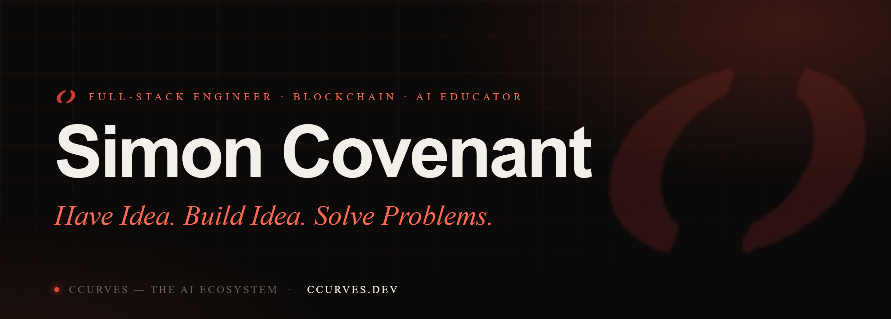

<!-- CCURVES · Simon Covenant — GitHub profile README. Portal to ccurves.dev. -->

  

  <a href="https://ccurves.dev"><b>ccurves.dev</b></a> &nbsp;·&nbsp;
  <a href="https://academy.ccurves.dev">Academy</a> &nbsp;·&nbsp;
  <a href="https://agency.ccurves.dev">Agency</a> &nbsp;·&nbsp;
  <a href="https://ida.ccurves.dev">Ida</a> &nbsp;·&nbsp;
  <a href="https://wall.ccurves.dev">The Wall</a> &nbsp;·&nbsp;
  <a href="https://scents.ccurves.dev">ScentsByC</a>

  
  
  
  

---

## Hi, I'm Simon Covenant

I build **CCURVES** — an AI ecosystem that turns everyday people into builders and ideas into real, shipped products. I work end-to-end: full-stack engineering, Web3 & smart contracts, and shipping AI into products people actually use — then I teach others to do the same.

> **Have Idea. Build Idea. Solve Problems.**

- 🧠 **Founder & lead instructor, [CCURVES Academy](https://academy.ccurves.dev)** — *AI Software Development Mastery*, with **110+ developers** learning to build and ship with AI.
- 🛠️ **Founder, [CCURVES Agency](https://agency.ccurves.dev)** — AI systems, automation and software, designed and shipped for businesses.
- 🤖 **Builder of [Ida](https://ida.ccurves.dev)** — the CCURVES AI assistant, live across web, Telegram and WhatsApp.
- 🎤 **Speaker & advocate** — AI, building, and the *execution gap* — from campuses to community stages.
- 📫 **Reach me:** [ccurves.dev](https://ccurves.dev) · iamccurves@gmail.com

---

## 🌐 The CCURVES ecosystem

One brand, many doors — everything I'm building lives here:

| | | |
|---|---|---|
| **[The Hub](https://ccurves.dev)** | `ccurves.dev` | The front door to everything CCURVES. |
| **[The Academy](https://academy.ccurves.dev)** | `academy.ccurves.dev` | Learn to build with AI — classroom, leaderboard, certificates. |
| **[The Agency](https://agency.ccurves.dev)** | `agency.ccurves.dev` | AI systems & software, built and shipped for you. |
| **[Ida](https://ida.ccurves.dev)** | `ida.ccurves.dev` | The CCURVES AI — your voice-first guide across the ecosystem. |
| **[The Wall](https://wall.ccurves.dev)** | `wall.ccurves.dev` | A gallery of real products built by CCURVES students. |
| **[ScentsByC](https://scents.ccurves.dev)** | `scents.ccurves.dev` | The CCURVES fragrance house — sold as an experience. |

---

## ⚡ What I do

- **Full-stack product development** — end-to-end modern web apps, from data model to a polished, human-centered UI.
- **Web3 & smart contracts** — decentralized systems and smart-contract architecture built to be safe and scalable.
- **AI product integration** — agents, tooling, retrieval, and AI-powered platforms shipped into real products.
- **Education & mentorship** — teaching developers to actually ship, through structured coursework, reviews and mentorship.
- **Technology advocacy** — advancing tech through media, stages and community — making it accessible to everyone.

---

## 🧰 Tech I build with

---

## 📊 GitHub

  
  

---

## 🤝 Connect

  
  
  
  
  
  
  

---

  <a href="https://ccurves.dev"><b>Have an idea? Come build it with us → ccurves.dev</b></a> 
  CCURVES — the AI ecosystem of Simon Covenant.

